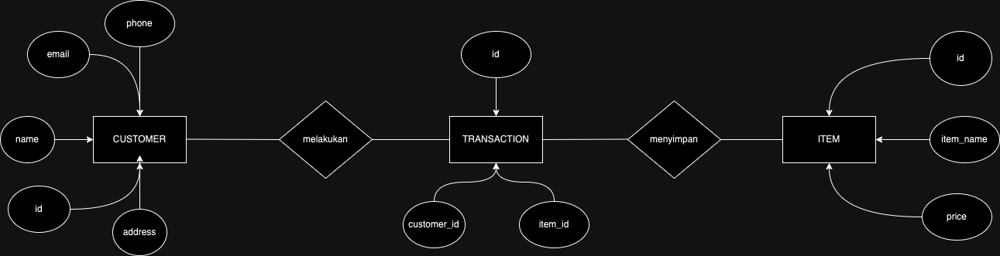
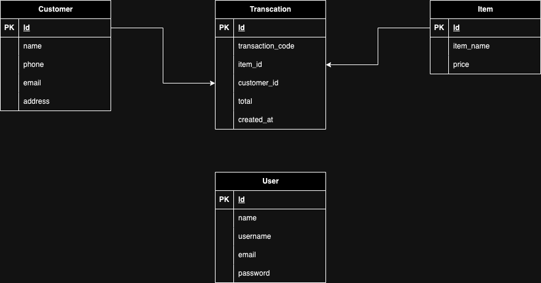
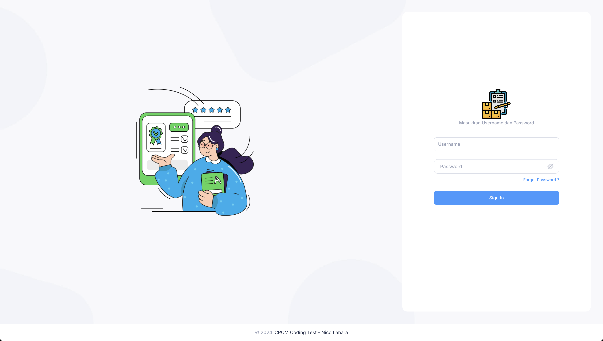
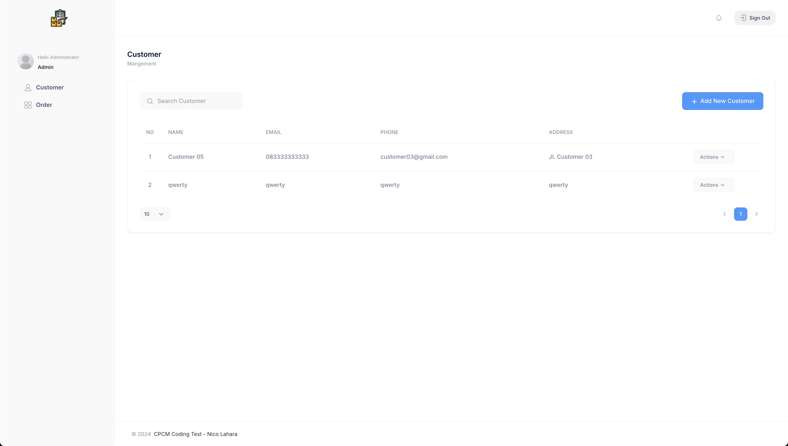
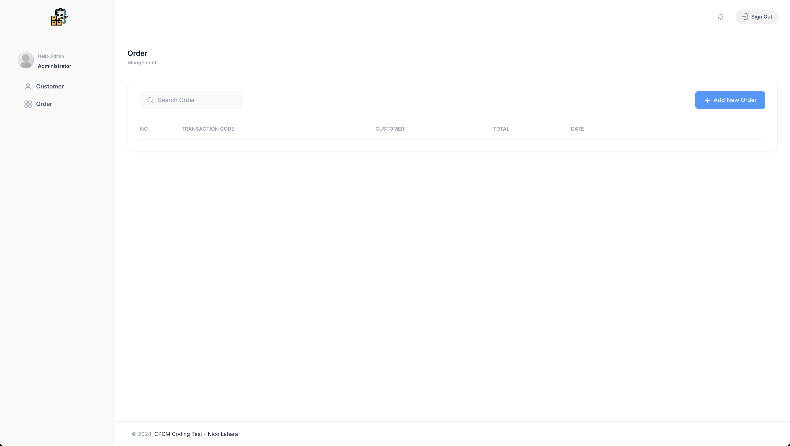

# cpcm-conding-test
CPCM Coding Test
username : administrator
password : password

## API
### POST /api/auth/login
### POST /api/customer/data
### GET /api/customer/get/{id}
### PUT /api/customer/update/{id}
### DELETE /api/customer/delete/{id}
### GET /api/customer/data
### POST /api/order/data
### GET /api/order/get/{id}
### PUT /api/order/update/{id}
### DELETE /api/order/delete/{id}
### GET /api/order/data

## ERD 

## Screenshot
login page

login fail

login success

customer page

Add New Customer

Customer Delete Confirmation

Customer Delete Success

Customer Detail

Customer Update Success

Order Page

Add New Order

Logout Confirmation

Logout Success
